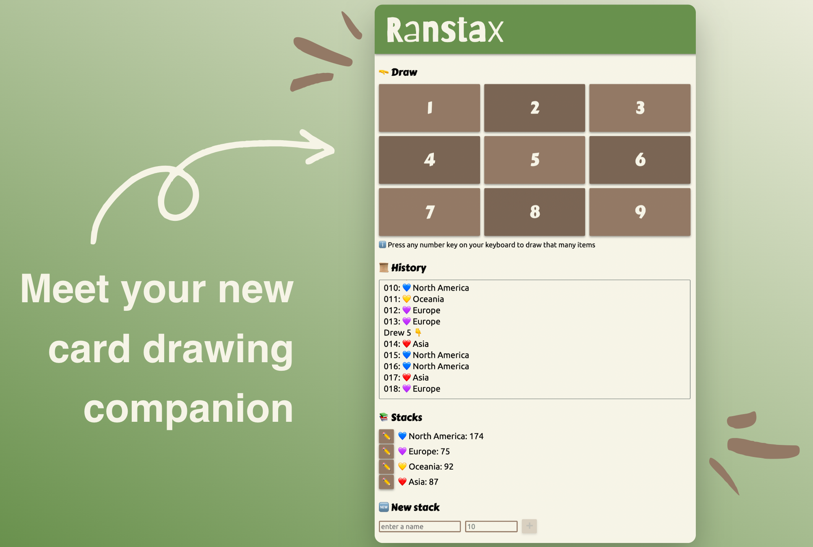

# 🎲 Ranstax

> Draw from random stacks 🃏

https://erikhuizinga.github.io/ranstax/

## About

[Read the announcement!](https://github.com/erikhuizinga/ranstax/discussions/1)

## Contributing

Feel free to [open an issue](https://github.com/erikhuizinga/ranstax/issues/new),
[pull request](https://docs.github.com/en/pull-requests/collaborating-with-pull-requests/proposing-changes-to-your-work-with-pull-requests/creating-a-pull-request),
[discussion](https://github.com/erikhuizinga/ranstax/discussions), or contact me in any other way
that you know me: @erikhuizinga.
